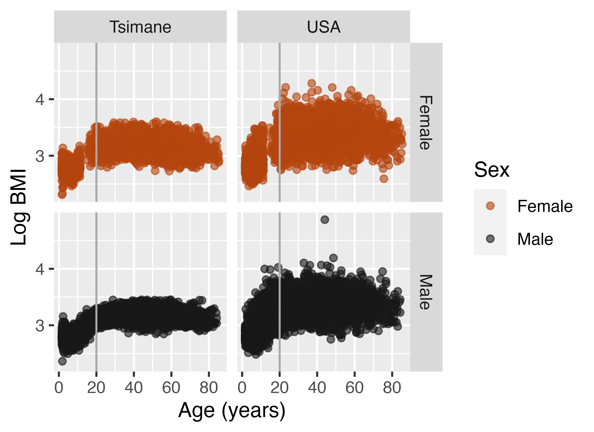
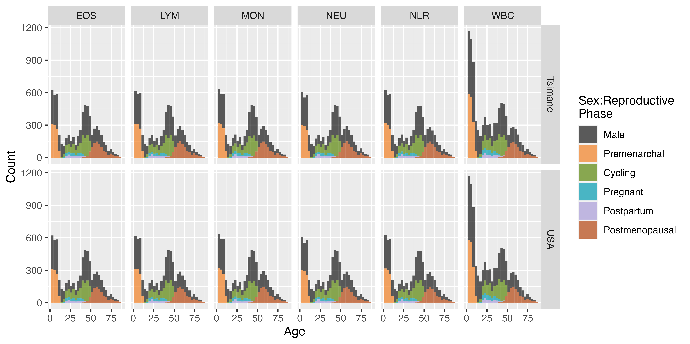

```{r supplement setup, include=FALSE}
knitr::opts_chunk$set(echo = TRUE)
pacman::p_load(devtools, tidyverse, openxlsx, ggpubr,
               brms, calecopal, citr, knitr, wordcountaddin)

load('pnas.RData')
```

## Supplementary Information
<!-- SI file formats: -->

<!-- SI Appendix: Supply a single PDF file, combining all text, figures, tables, movie legends, and SI references. See the PNAS SI template. -->
<!-- Datasets: Supply XLSX, RTF, PDF, CSV, GZ, or TXT files. -->
<!-- Movies: Supply AVI, MOV, WMV, GIF, or MPEG files at the desired reproduction size and length. Movies are limited to 10 MB in size. Include a brief legend for each movie in the SI Appendix. -->
<!-- Software: Supply source code or scripts in native file types. -->
<!-- When preparing SI files, please note the following: -->

<!-- The main text of the paper must stand on its own without the SI. -->
<!-- SI is referred to in the text and cannot be altered by authors after acceptance. -->
<!-- Refer to the SI Appendix in the manuscript at an appropriate point in the text. Number supporting figures and tables starting with S1, S2, etc. References should be cited in numerical order as they appear in the SI; do not cite main-text references in the SI and vice versa. -->

### Figures 
{width=50%}

\newpage

{width=100%}

\newpage

### Tables

```{r, echo=F}
knitr::kable(table_s1 %>% 
               rename(Premenarchal = `Pre-Menst`,
                      Postmenopausal = Menopause), 
             caption = "Table S1. Final matched sample sizes by measure, population, and sex:female reproductive phase.")
```

\newpage

```{r, echo=F}
knitr::kable(table_s2 %>% 
               rename(Premenarchal = `Pre-Menst`,
                      Postmenopausal = Menopause), 
             caption = "Table S2. Number and corresponding percentage of unique participants out of the total THLHP sample by measure and sex:female reproductive phase.")
```

\newpage
 
```{r, echo=F}
knitr::kable(table_s3 %>% 
               mutate(`Reproductive Phase` = case_when(`Reproductive Phase` == "Pre-Menst" ~ "Premenarchal",
                                           `Reproductive Phase` == "Menopause" ~ "Postmenopausal",
                                           TRUE ~ `Reproductive Phase`),
                      `Reproductive Phase` = ordered(`Reproductive Phase`,
                            levels = c("Premenarchal","Cycling","Pregnant",
                                       "Postpartum","Postmenopausal"))) %>%
               select(Population, Measure, `Reproductive Phase`, Age, NumPartos, Bias, `Female Value`, `Male Value`) %>% 
               rename(Parity = NumPartos) %>% 
               arrange(`Reproductive Phase`,Population,Measure), 
             caption = "Table S3. Ages and values at which the absolute difference in immune outcomes between females and their male counterparts is greatest, separated by female reproductive phase, population, and immune measure.")
```

\newpage
 
```{r, echo=F}
knitr::kable(model_summaries %>% filter(Population == "Tsimane"),
             caption = "Table S4. Model terms, statistics, and p-values for Tsimane-specific models.")
```

\newpage
 
```{r, echo=F}
knitr::kable(model_summaries %>% filter(Population == "USA"),
             caption = "Table S5. Model terms, statistics, and p-values for USA-specific models.")
```